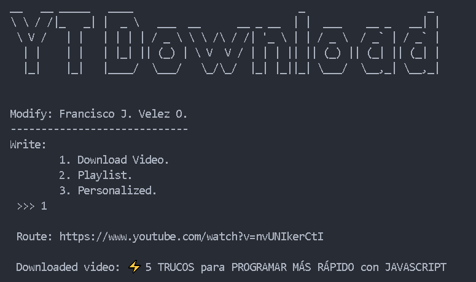
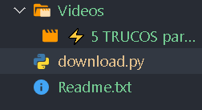

# App to download Youtube Videos

Project #1 with Python. Download videos from youtube.

## To use the code
When using the code it prints the options it has,
type the number of the option, type the information,
and wait while you download videos from youtube.

## Images of the graphical interface

**Image 1**

**Image 2**

<i>Best respect !!! </i>

**<cite>Author: Francisco Velez</cite>**
